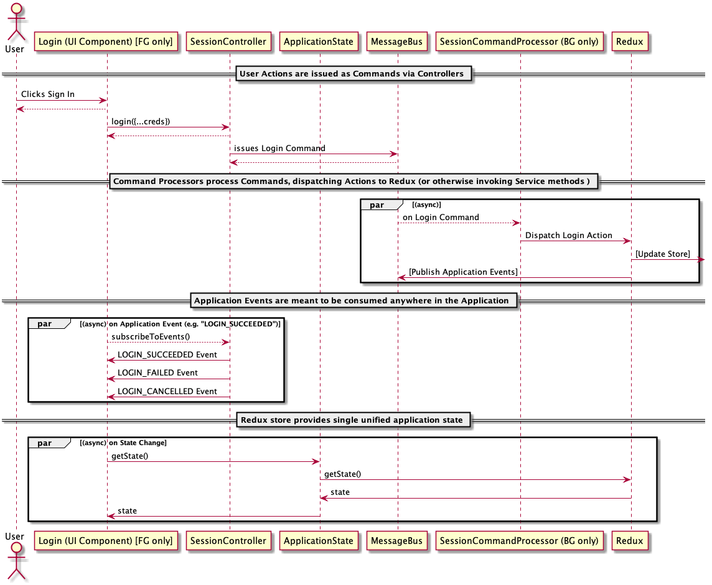

# ZaiCommunicator

## Usage

### Instructions - Clone the app

1. `npm install / yarn install` (we'll only use one when this is development ready)
1. `au build` - ensures you have a `dist` before you begin developing (you need a `dist/` folder to import the extension into chrome)
1. `au run` - and **wait** until it's running before proceeding
1. Load `dist` folder as an unpacked extension in chrome://extensions
1. once it's running, open `Options`, and ensure you are set up for an environment that works

### Instructions

When developing and need to work in the `service worker`, the logs for the `service worker` can be viewed at `chrome://inspect/#service-workers`. Inspect the preferred `service worker` from the list.

### Development Mode

Note, that there is a context menu called _Developer Context Menu_. This will allow running the application in a standalone window.

**NB!!!!**: when developing, you can only have one "window" open at a time, so if you are using the _Developer Context Menu_, you won't be able to access "Options" via the extension button in the browser window, until you either close the _Developer Context Menu_, or otherwise, use the nav link in the _Developer Context Menu_ to navigate to the Options screen

## Quick and Dirty Overview of how this all works

- UI Components are/will be very dumb
  - they interact with a `Controller`, to
    - achieve user actions as `Commands`
    - listen to `Application Events`
  - they listen to `ApplicationState` for Redux State changes (state lives in a single `Redux` store)
  - fire and forget
- `Controllers` merely dispatch `Commands` or otherwise invoke Service functionality
  - they do this via a `MessageBus`
  - fire and forget
- `MessageBus`
  - wrapper around EventAggregator
  - `publishEvent` and `sendCommand`
  - publish and subscription delegates
  - ensures that messages are published / subscribed to multiple processes, e.g. in case of Chrome Extension, background and content scripts, popups, etc.
- `CommandProcessors`

  - each command should be handled by a maximum of 1 processor.
  - either:
    - **dispatches** `Redux Actions`
    - **invokes** other service functionality
  - `CommandProcessors` always run in background process (when applicable)
    - they should never be Injected into Foreground components

- Application Events vs Redux Store State Changed
  - Application Events
    - meant for consumption application-wide
    - can be created anywhere in the application where it makes sense to do so
  - Redux Store State Changed
    - meant purely to communicate changes to state

---

# OLD NOTES BELOW, NOT updated

## Usage

### Clone the app

1.  Clone repo and run `npm install`
1.  Run app with `au run`
1.  Load `dist` folder as an unpacked extension in chrome://extensions

### Build the app

You can run the following command:
\$`npm build` or \$`au build`

### Start the app

You can run the following command:
\$`npm start` or \$`au run`

### Test the app

Still needs to be implemented:

---

# Documentation

#### Popup States

##### `Below you will find the view flows for the application`

##### Top level view flow is as follows:

---

##### Phone level view flow:

---

---

## NEW README

For dev, first run `au build` then run `au run` - this ensures that you always have a dist folder to load an unbundled extension from
